# 🧠 ShiftBrain: Scientific & Algorithmic Decision Log

  

This log documents the somnology research, mathematical formulas, and biological decision logic behind ShiftBrain's adaptive engine. It details how the product resolves critical circadian hurdles that traditional calendar and wellness applications ignore.

---

## 📈 Adenosine Accumulation & Sleep Pressure Curve

The diagram below illustrates the homeostatic sleep pressure curve (adenosine buildup) over a 24-hour cycle, highlighting how our algorithmic **Nap Offset** delays the clinical cognitive impairment thresholds:

```mermaid
gantt
    title Dynamic Sleep Pressure (Adenosine Build-up)
    dateFormat  X
    axisFormat %H:00
    
    section Baseline (10 AM Wake)
    Awake & Alert           :active, 0, 10
    17h Threshold (BAC 0.05%) :crit, 10, 13
    20h Threshold (BAC 0.10%) :milestone, 13, 16
    
    section With 4h Nap Offset (Nap checked at Wake + 9h)
    Adenosine Clearance (Nap):done, 0, 9
    Delayed 17h Deficit     :active, 9, 16
    Delayed 20h Deficit     :crit, 16, 20
```

---

## 1. Mathematical Modeling: Sleep Debt & Quality Scaling

### The Biological Hurdle
Traditional sleep trackers calculate sleep debt as a static linear formula:
$$\text{Sleep Debt} = \text{Daily Baseline (e.g., 8.0h)} - \text{Duration Logged}$$

This is biologically inaccurate. Sleep *quality* (dictated by sleep architecture consistency and daytime ambient disruptions like light and noise) alters cognitive recovery. Eight hours of fragmented daytime sleep does not recover the brain as effectively as eight hours of dark, quiet night sleep.

### Our Solution
We implemented a subjective-quality scaling model to compute **Effective Sleep**:
$$\text{Effective Sleep} = \text{Logged Duration} \times \left(0.5 + \frac{\text{Subjective Quality Rating}}{20}\right)$$

> [!NOTE]
> In the user interface, we simplified the input into a binary question (*"Did you sleep well?"*) to minimize friction:
> *   **Yes, slept well (Internal 9/10 Quality):** Scales sleep effectiveness to $95\%$ of logged duration.
> *   **No, restless sleep (Internal 5/10 Quality):** Scales sleep effectiveness down to $75\%$ of logged duration.

This effective sleep value is subtracted from the user's daily baseline (configured during onboarding) to update a rolling sleep debt balance.

---

## 2. Sleep Pressure (Wake Timer) & The Nap Offset

### The Biological Hurdle
Continuous wakefulness causes the accumulation of adenosine in the brain, creating homeostatic sleep pressure. A simple timer tracking "hours awake" is useful, but it does not account for the restorative impact of short prophylactic or anchor naps, which clear adenosine.

### Our Solution
We implemented a dynamic sleep pressure offset:
1.  We track raw hours awake from the latest logged wake timestamp.
2.  If the user checks off their recommended **Pre-Shift Anchor Nap**, the engine automatically subtracts **4.0 hours** from their active homeostatic pressure wake-time calculation.
3.  This offset dynamically shifts the warning thresholds for cognitive impairment:

> [!WARNING]
> *   **17+ Net Hours Awake (BAC 0.05% Equivalent):** Matches a cognitive deficit equivalent to impaired motor control and slower reaction speeds.
> *   **20+ Net Hours Awake (BAC 0.10% Equivalent):** Matches legal intoxication levels, causing extreme microsleep risks.
> *   Checking off the nap subtracts 4 hours from sleep pressure, delaying these safety alerts and reflecting the physiological boost of a nap.

---

## 3. Metabolic Shift & Gut Clock Alignment

### The Biological Hurdle
The digestive system has its own peripheral circadian clock. Eating heavy, carbohydrate-dense meals during the night shift (when insulin sensitivity is naturally low and digestive processes slow down) leads to gastrointestinal issues, insulin resistance, and systemic inflammation.

### Our Solution
ShiftBrain schedules custom **Gut Clock Windows**:
*   The engine blocks heavy meals during the core night shift hours (12:00 AM – 5:00 AM).
*   It recommends light, protein-heavy, low-glycemic snacks instead of sweet chai or simple carbs to maintain stable blood sugar levels.
*   It enforces a strict **Digestive Wind-Down Window**: no caloric intake starting 3 hours prior to their sleep window, ensuring the digestive system rests during sleep.

---

## 4. The Social Jetlag Buffer (Weekend Transition)

### The Biological Hurdle
Rotational shift workers often flip their schedules back to "normal day hours" on off-days to spend time with family. This causes acute circadian disruption ("social jetlag")—the biological equivalent of flying back and forth across 8 timezones every single week, leading to chronic fatigue.

### Our Solution
We designed the **Circadian Transition Anchor**:
*   Instead of advising a hard, sudden shift-flip, the engine schedules a gradual **4-hour sleep delay protocol**.
*   On off-days, it maps **Split Sleep Windows** (e.g. 4 hours core sleep + 2 hours anchor nap) to let the worker spend daytime hours with family without experiencing biological shock.

---

## 5. Algorithmic Trust vs. Counter-Intuitive Guidelines

### The Biological Hurdle
Shift workers are frequently bombarded with generic, impossible health tips. To build trust, the app must explain the direct biological rationale behind counter-intuitive suggestions (e.g., *"Why should I wear sunglasses on my morning drive home?"*).

### Our Solution
Every task card in the timeline is designed around the **"What-When-Why"** paradigm:

*   **Sunglasses on Commute Home (What & When):** Wear sunglasses during the morning drive.
*   **Melatonin Activation (Why):** Exposure to morning daylight (10,000+ lux) during your commute home suppresses melatonin and releases cortisol, preventing you from sleeping during the day. Shielding your eyes triggers natural melatonin production.
*   **Caffeine Cutoff (What & When):** Stop caffeine 6 hours before sleep.
*   **Adenosine Clearance (Why):** Caffeine binds to adenosine receptors, masking sleep pressure. Stopping it 6 hours early ensures your receptors clear, allowing deep, restorative sleep.

---

## 6. Comparison: ShiftBrain vs. Traditional Trackers

| Feature | Static Fitness Trackers | Notion / Todoist Calendars | ShiftBrain Adaptive Engine |
| :--- | :--- | :--- | :--- |
| **Midnight Wraps** | Splits data at 12 AM. | Requires manual time moves. | Models entire day around active **Wake-to-Sleep Cycle**. |
| **Fatigue Calculations** | Retrospective analysis only. | None. | Dynamic homeostatic sleep pressure & quality scaling. |
| **Commute Durations** | Ignored. | Listed as travel times. | Triggers auto-naps and blue-blocker window offsets. |
| **Cognitive Upskilling** | No coordination. | Scheduled statically. | Schedules **Focus Blocks** at predicted peak alertness windows. |

---

## 7. Somnology & Research Foundations

Our algorithms rely on established circadian and somnology research:
1.  **Sleep Debt & Impairment:** Studies by *Dawson & Reid (1997)* and *Williamson & Feyer (2000)* established that 17-19 hours of continuous wakefulness produces cognitive degradation equivalent to a BAC of 0.05%, and 20-24 hours matches 0.10% BAC.
2.  **Light and Melatonin Suppression:** Research on intrinsically photosensitive retinal ganglion cells (ipRGCs) shows peak sensitivity to blue light (460-480nm). Shielding eyes from morning daylight is proven to mitigate daytime sleep onset insomnia.
3.  **Prophylactic Naps:** Clinical trials on emergency medicine residents and aviation pilots confirm that a pre-shift anchor nap of 30-40 minutes significantly reduces lapses in attention during overnight duties.

---

## 8. Rest Day Optimization: Guilt-Free Rest vs. Progressive Upskilling

### The Biological & Psychological Hurdle
A week off is a double-edged sword for shift workers:
1.  **Circadian Jetlag:** Shifting sleep times on off-days to match natural daytime schedules causes acute circadian misalignment ("social jetlag"), leading to insomnia and high fatigue when returning to night shifts.
2.  **Productivity Guilt:** Tired workers who attempt to optimize their rest days with generic task managers or numerical "Day Scores" (e.g., `60/100`) experience anxiety upon missing goals, which raises cortisol and degrades sleep latency.
3.  **Upskilling Trade-offs:** While baseline recovery is vital, ambitious shift workers need their few off-days to build portfolios, prep healthy meals, or handle life administration.

### Our Solution
We implemented structured **Week Off Focus Modes** coupled with an **Outcome-Based Wins Ledger**:
*   **Five Specialized Day Modes:** The circadian engine generates distinct, custom timelines mapped to specific objectives:
    *   🛋️ **Recovery:** Maximizes sleep debt clearance, decompression, and a 9h recovery sleep.
    *   🚀 **Growth:** Schedules dual 2-hour deep coding blocks during peak biological focus windows.
    *   🏋️ **Fitness:** Blocks out meal preparation, hydration resets, and strength training.
    *   🍕 **Social:** Allocates daylight relationship time and digital-free evening dinners.
    *   🧹 **Reset:** Plans workspace decluttering, budget admin, and next week's schedule planning.
*   **Guilt-Free Outcomes Wins Ledger:** We completely removed abstract numerical scoring. Toggled checklist tasks are translated into positive real-world wins (e.g., *“Completed deep upskilling coding sprint”* or *“Banked recovery sleep & restored energy”*). This builds a positive "Personal Life Resume" without anxiety.
