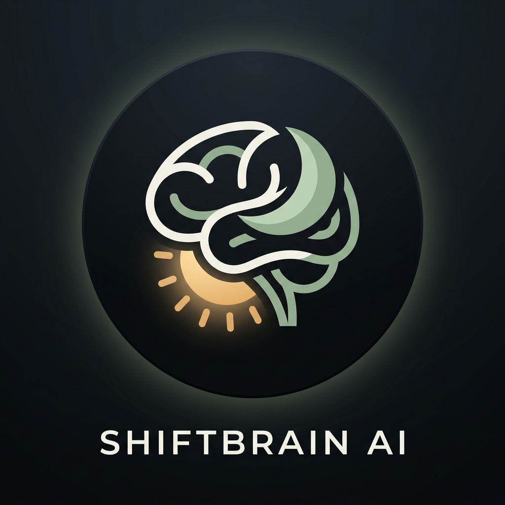
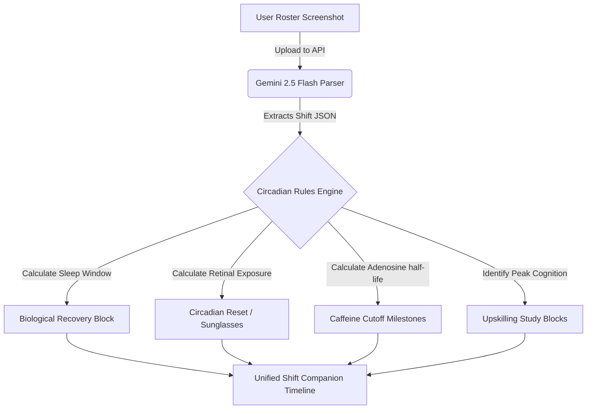

# 🧠 ShiftBrain
<p align="center">
  
</p>

### The Life Operating System & Companion for Shift Workers

> [!NOTE]
> ShiftBrain is a mobile-first, circadian-adaptation web application designed to help night-shift and rotational workers manage their sleep cycles, caffeine cutoffs, upskilling blocks, and light exposure. 
> Designed around **Apple Health simplicity, Duolingo clarity, and Notion cleanliness**, it passes the **5-second test** to guide fatigued workers with a single tap.

---

## 🗺️ System Architecture Flow

The following diagram illustrates how user schedules are parsed, computed, and converted into action-ready timelines:



---

## 🌟 Core Features & Circadian Value Mapping

| Feature | Primary Focus | Physiological Purpose | Action Trigger |
| :--- | :--- | :--- | :--- |
| **Next Best Action (Hero)** | Chrono-Prioritization | Guides decisions instantly under high cognitive fatigue. | Single-tap `Mark Complete` |
| **OCR Roster Scanner** | Frictionless Ingestion | Converts confusing shift images (Excel, Kronos) in 3 seconds. | Drag & Drop image upload |
| **Upcoming Timeline** | Truncated Horizon | Shows the next 3 steps only to avoid calendar overwhelm. | Chronological timeline dot |
| **Caring Safety Alerts** | Biomarker Defense | Notifies users when continuous awake time hits 17h/20h limits. | Apple Health-style banner |
| **Sleep Logger** | Telemetry Tracking | Recalculates sleep debt dynamically scaling by quality. | Quality slider (1-10) |
| **Caffeine Cutoff** | Sleep Latency | Blocks caffeine 6h before sleep to clear adenosine receptors. | Dynamic alarm notification |

---

## 🛠️ Technology Stack
*   **Core Framework:** Next.js (App Router, React 19, TypeScript)
*   **Styling:** Tailwind CSS v4 & PostCSS (Custom warm Sand & Sage palette)
*   **AI Integration:** `@google/generative-ai` (Gemini 2.5 Flash & 3.5 Flash)
*   **Icons:** Lucide React
*   **Database:** Supabase & PostgreSQL (Schema defined in `schema.sql`)

---

## 🚀 Local Quick-Start Guide

### 1. Install Dependencies
Ensure you have Node.js installed, then run:
```bash
npm install
```

### 2. Configure Environment
Create a `.env.local` file in the root of the project:
```env
GEMINI_API_KEY="your-google-gemini-api-key"
```
> [!TIP]
> You can acquire a free Gemini API key from [Google AI Studio](https://aistudio.google.com/).

### 3. Run the Development Server
```bash
npm run dev
```
Open [http://localhost:3000](http://localhost:3000) on your device or in desktop browser mobile simulator mode.

---

## 📑 Codebase Navigational Map

Explore the core algorithms, pages, and schema files:

*   **Circadian Rules Algorithm:** [circadianEngine.ts](src/lib/circadianEngine.ts) - Computes optimal sleep/wake cycles.
*   **Gemini Parser API:** [route.ts](src/app/api/parse-roster/route.ts) - Base64 encodes images and runs Gemini fallback streams.
*   **Shift Companion Interface:** [page.tsx](src/app/page.tsx) - Renders the mobile onboarding and timelines.
*   **Database Foundations:** [schema.sql](schema.sql) - Production DDL tables and indexes.

> [!IMPORTANT]
> Read our [PROBLEM_SOLVING.md](PROBLEM_SOLVING.md) to understand how we solved major circadian-overlap, date-wrapping, and Gemini API fallback challenges.
